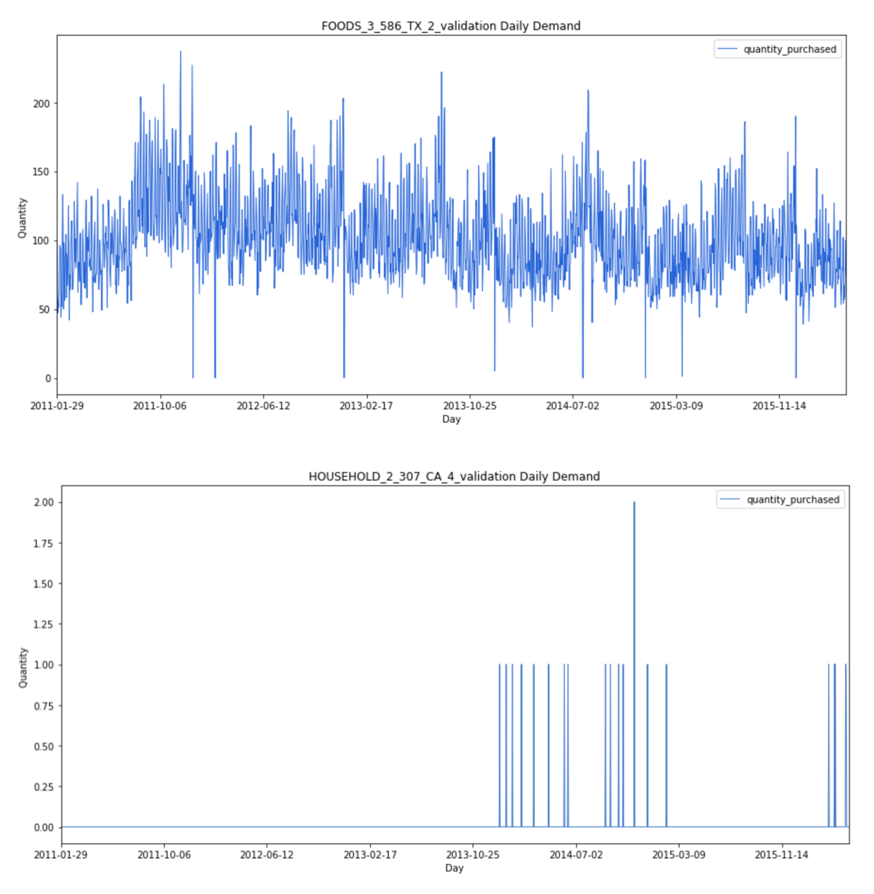
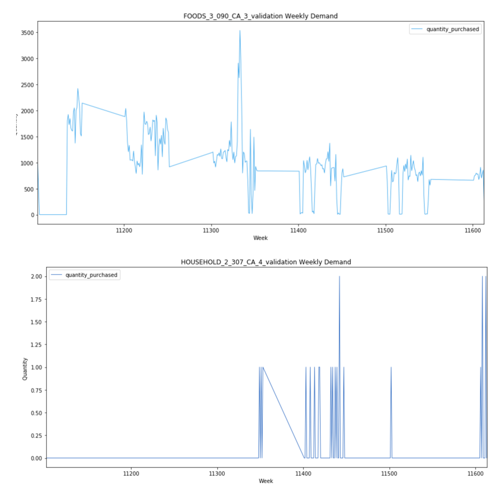
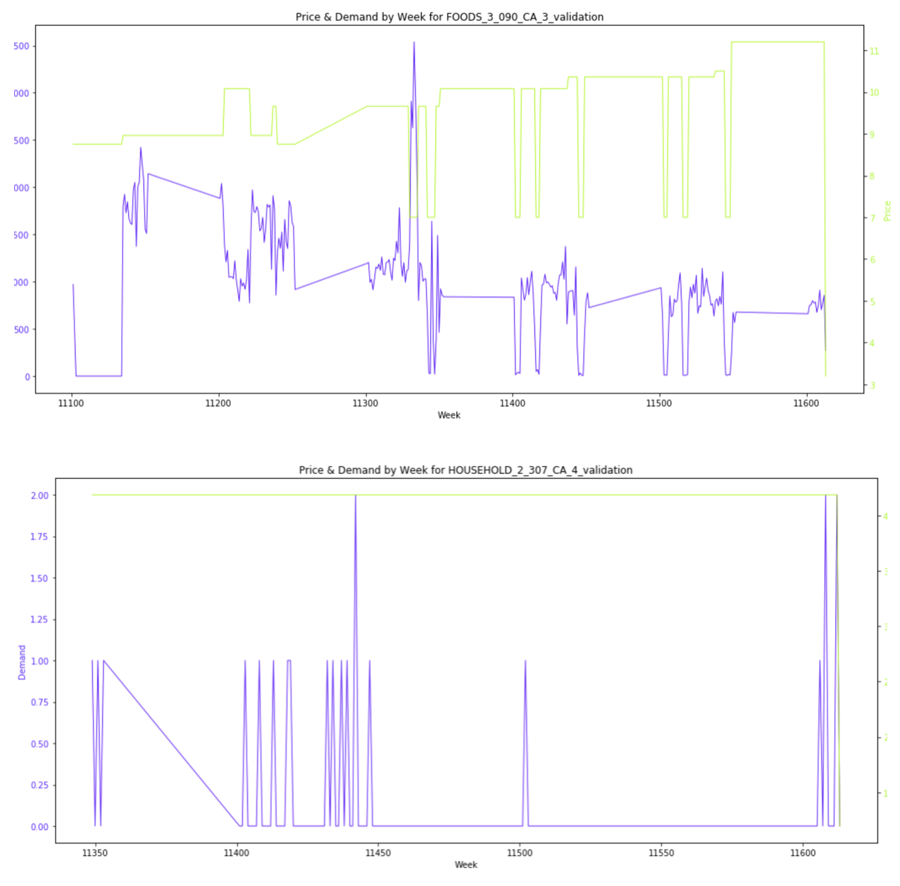
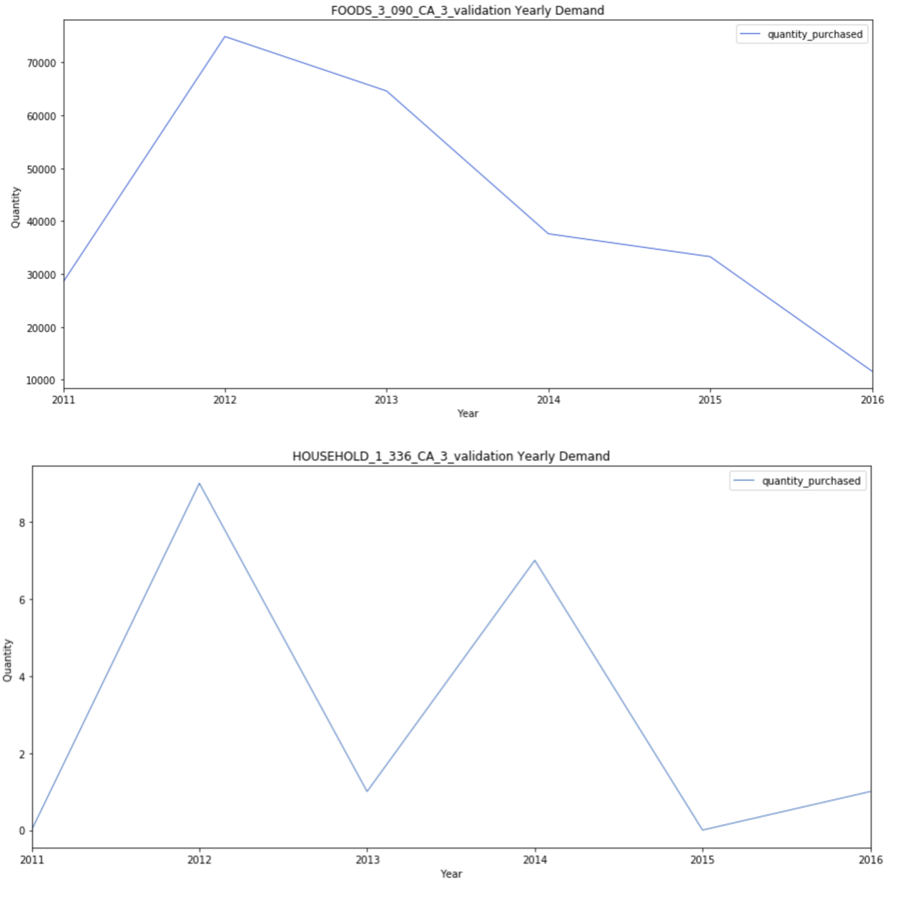
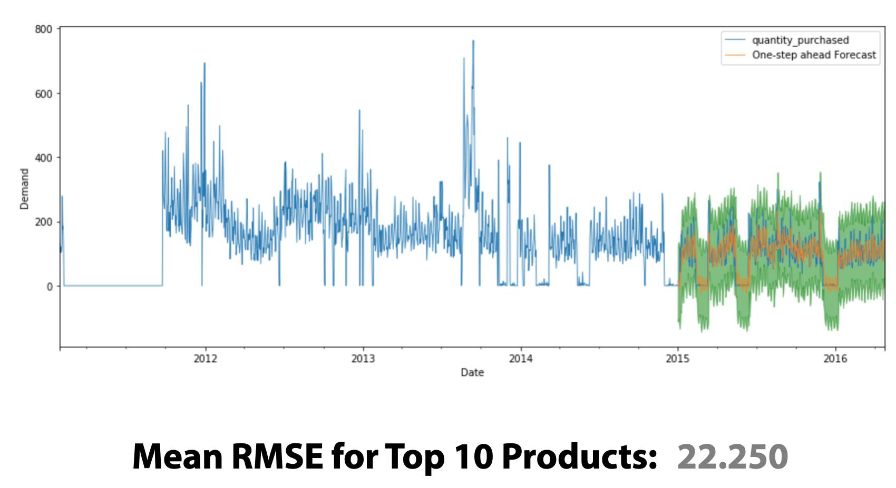

# 👨🏼‍💻 Capstone
# 👋🏼 Hey, welcome. 

## 🛰️ Navigating This Project 

For my capstone project from Flatiron, I decided to explore another Time Series model. This repository is very much a work in progress as there are many deep learning models, outside the scope of the curriculum that I would like to explore.

## Project Objective

This dataset is actually from a current [Kaggle competition](https://www.kaggle.com/c/m5-forecasting-accuracy/data).

It's pretty straightforward, but the objective is to predict the demand for the next 28 days for 30,490 unique product/store combinations.

# Observations
## Daily Demand for top product and bottom product

For the product that is in the Top 10, we can see quite a lot of activity, including times when it appears the product sold out. Overall, it appears stationary and most closely resembles a white noise model. 

For the product in the Bottom 10, we see virutally no pattern. It sells rarely and with no apparent pattern whatsoever. As you will see, this is fairly typical behvaior for any of the products in the Bottom 10.

## Weekly Demand for top product and bottom product

We start to see a little bit more of a pattern emerge for the high-volume products. There appear to be times of high volatility, followed by a more steady demand. We'll be able to shed even more light when we look at the weekly demanded plotted with price information, as seen below.

Aggregated at the weekly level, we start to see a little bit more actiivty for the lower-volume products, but there still really isn't a discernible pattern.

## Weekly Demand (with price behavior) for top product and bottom product

Here the weekly demand starts to make a little bit more sense. You'll see this across all of the high-volume products. You can notice obvious patterns of when price decreases, demand increases. You'll also see the opposite is true - if price decreases, demand also decreases. This happens close to 0 however, and it appears that they might be having a difficult time keeping this particular product stocked.

Again, no pattern for low-volume products.

## Yearly Demand for top product and bottom product

This gives a good sense of the overall, macro trend of the product over the ~4.5 years. This will vary greatly from product to product but for just about every single high-volume product, there is definitely a clear trend.

The same cannot be said for the lower-volume products, however. The demand is so low that we really aren't able to make any meaningful observations.

## Demand Heatmap

We are able to see a lot of varying activity for this particular product, with a peak happening most years around summertime.

No pattern for bottom products.

### Explore the rest of the EDA [here.](EDA.ipynb)

# Model

In the end, I settled on an ARIMA model. The RMSE for the top 10 products was 22.250. As part of future work, I plan to train the model on all 30,490 products.

For more, in-depth information about the model, check out this [Jupyter Notebook.](Modeling.ipynb)

# For more info,

Check out my [presentation](project_5.pdf).

